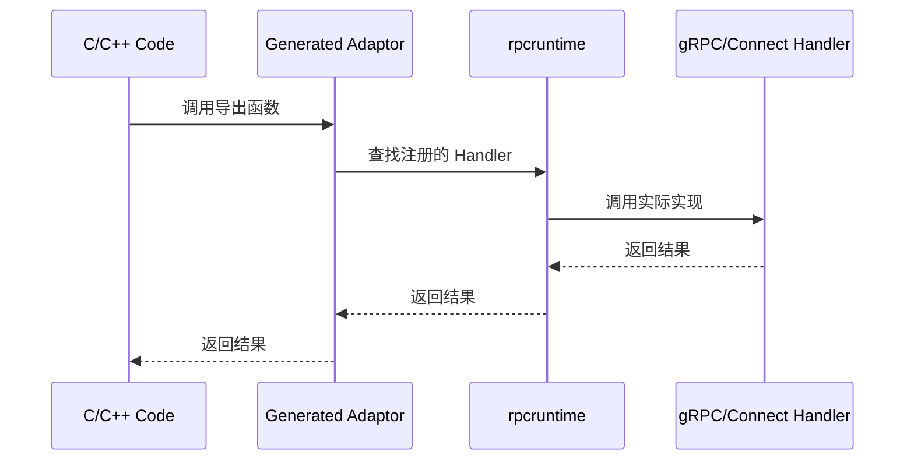

# rpccgo
write cgo like rpc



## Runtime：错误信息注册表（Error Registry）

本仓库实现了一个可复用的运行时能力：把“错误信息文本/字节”与一个整型 `errorId` 绑定，使得 CGO 导出函数只需要返回 `errorId != 0`，C 侧即可通过稳定 ABI 拉取错误信息。

### 为什么需要它

在跨语言/跨 ABI 场景下：

- 直接返回 Go 字符串指针不安全（生命周期、GC、跨线程/跨语言释放规则不明确）。
- 直接在导出函数里把错误信息塞进 `char*` 需要定义“谁分配、谁释放、何时释放”的统一规则。

因此这里采用“`errorId` + `Ygrpc_GetErrorMsg` 拉取”的两步模型：

1. Go 侧把错误信息写入全局 registry，拿到 `errorId`。
2. C 侧用 `Ygrpc_GetErrorMsg(errorId, ...)` 拉回一段 `malloc` 分配的字节缓冲，并拿到可调用的 `free`。

### TTL 与清理策略

registry 中的 `errorId -> errorMsg(bytes)` 记录应当“保留约 3 秒”。

- 读取时会检查是否过期：过期即删除并视为 not-found。
- 运行时也会启动一个轻量后台清理循环，定期清掉过期记录。

这既避免了错误消息无限增长，也让 C 侧有一个短窗口来拉取信息。

## Go API（rpcruntime）

实现位于目录 [rpcruntime](rpcruntime)。

- `StoreError(err error) int`：存入 `err.Error()`，返回 `errorId`（`err==nil` 返回 `0`）。
- `StoreErrorMsg(msg []byte) int`：存入任意字节消息，返回 `errorId`。
- `GetErrorMsgBytes(errorId int) ([]byte, bool)`：取回消息（拷贝），不存在/过期返回 `false`。

### Go 侧最小用法示例

```go
id := rpcruntime.StoreError(err)
if id != 0 {
	// 把 id 通过你的 ABI 返回给 C 侧
}
```

## C ABI：Ygrpc_GetErrorMsg（设计规范）

OpenSpec 定义的 ABI 原型如下（由后续的 `protoc-gen-rpc-cgo` 生成器生成实际的 CGO 导出代码）：

```c
typedef void (*FreeFunc)(void*);

int Ygrpc_GetErrorMsg(int error_id, void** msg_ptr, int* msg_len, FreeFunc* msg_free);
```

语义：

- 返回 `0`：找到消息，输出 `msg_ptr`/`msg_len`/`msg_free`。
- 返回 `1`：未找到或已过期。

缓冲区规则：

- `msg_ptr` 必须是 `malloc` 兼容分配的内存。
- `msg_free` 必须是可调用的释放函数，兼容 `free(msg_ptr)`。

## protoc-gen-rpc-cgo-adaptor

`protoc-gen-rpc-cgo-adaptor` 是一个 protoc 插件，用于生成 CGO 适配器代码。它将 CGO 调用桥接到已注册的 gRPC 或 Connect 服务处理器。

### 作用

在跨语言 FFI/CGO 场景下，通常需要：
1. 从 C/C++ 等外部语言调用 Go 实现的 gRPC/Connect 服务
2. 避免启动完整的网络服务器，直接在进程内调用

该插件生成的适配器代码：
- 提供 C-ABI 友好的函数签名
- 自动将请求路由到已注册的 gRPC 或 Connect Handler
- 支持 Unary、Client-Streaming、Server-Streaming、Bidi-Streaming 全部四种 RPC 类型
- 使用 `rpcruntime` 包管理协议分发和流式传输

### 安装

```bash
go install github.com/ygrpc/rpccgo/cmd/protoc-gen-rpc-cgo-adaptor@latest
```

### 使用

#### 生成代码

```bash
# 生成 gRPC 适配器
protoc -I. --rpc-cgo-adaptor_out=./output \
  --rpc-cgo-adaptor_opt=paths=source_relative,protocol=grpc \
  your_service.proto

# 生成 Connect 适配器（默认）
protoc -I. --rpc-cgo-adaptor_out=./output \
  --rpc-cgo-adaptor_opt=paths=source_relative \
  your_service.proto

# 同时生成支持 gRPC + ConnectRPC 的通用适配器（按顺序 fallback）
protoc -I. --rpc-cgo-adaptor_out=./output \
  --rpc-cgo-adaptor_opt=paths=source_relative,protocol=grpc|connectrpc \
  your_service.proto
```

#### 选项说明

| 选项 | 值 | 说明 |
|------|------|------|
| `protocol` | `grpc` / `connectrpc` / `grpc|connectrpc`（`|` 分隔、有序列表） | 选择生成支持的协议列表；ctx 未指定时按顺序 fallback；默认为 `connectrpc` |
| `connect_package_suffix` | 例如 `connect` | connect-go 的 `package_suffix`；非空时 connect handler interface 位于 `<import-path>/<go-package-name><suffix>` |
| `paths` | `source_relative`, `import` | 输出路径模式 |

> **注意**: Connect 框架仅支持 Simple API 模式（使用 `protoc-gen-connect-go` 的 `simple=true` 选项生成的代码）。

### 使用示例

假设有以下 proto 定义：

```protobuf
service TestService {
  rpc Ping(PingRequest) returns (PingResponse);
  rpc StreamCall(stream StreamRequest) returns (StreamResponse);
}
```

生成的适配器代码提供：

```go
// Unary 调用
func TestService_Ping(ctx context.Context, req *PingRequest) (*PingResponse, error)

// Client-Streaming 调用
func TestService_StreamCallStart(ctx context.Context) (uint64, error)
func TestService_StreamCallSend(handle uint64, req *StreamRequest) error
func TestService_StreamCallFinish(handle uint64) (*StreamResponse, error)
```

### 注册处理器

在调用适配器函数之前，需要注册实际的服务处理器：

```go
// 注册 gRPC Handler
handler := &MyTestServiceServer{}
rpcruntime.RegisterGrpcHandler("your.package.TestService", handler)

// 注册 Connect Handler
handler := &MyTestServiceHandler{}
rpcruntime.RegisterConnectHandler("your.package.TestService", handler)
```

### 流式 RPC 示例

#### Client-Streaming

```go
ctx := context.Background()

// 1. 开始流式调用
handle, err := TestService_ClientStreamCallStart(ctx)

// 2. 发送多条消息
TestService_ClientStreamCallSend(handle, &StreamRequest{Data: "msg1"})
TestService_ClientStreamCallSend(handle, &StreamRequest{Data: "msg2"})

// 3. 完成并获取响应
resp, err := TestService_ClientStreamCallFinish(handle)
```

#### Server-Streaming

```go
ctx := context.Background()

// 使用回调接收响应
err := TestService_ServerStreamCall(ctx, req,
    func(resp *StreamResponse) bool {
        fmt.Println("Received:", resp.GetResult())
        return true // 返回 false 停止接收
    },
    func(err error) {
        fmt.Println("Stream completed:", err)
    },
)
```

#### Bidi-Streaming

```go
ctx := context.Background()

// 1. 开始流式调用，提供接收回调
handle, err := TestService_BidiStreamCallStart(ctx,
    func(resp *StreamResponse) bool {
        fmt.Println("Received:", resp.GetResult())
        return true
    },
    func(err error) {
        fmt.Println("Stream completed:", err)
    },
)

// 2. 发送消息
TestService_BidiStreamCallSend(handle, &StreamRequest{Data: "msg1"})
TestService_BidiStreamCallSend(handle, &StreamRequest{Data: "msg2"})

// 3. 关闭发送端
TestService_BidiStreamCallCloseSend(handle)
```
